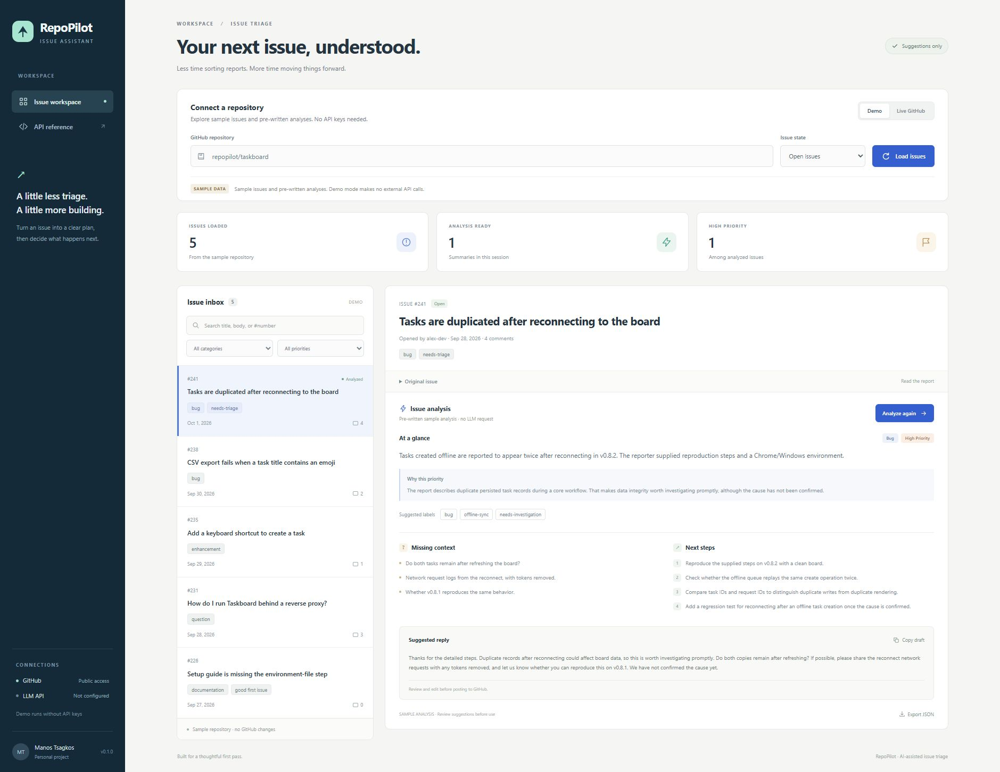

# RepoPilot

[](https://github.com/ManosTsagkos/RepoPilot/actions/workflows/ci.yml)

An AI assistant for reviewing GitHub issues. RepoPilot turns an issue into a concise summary, a suggested category and priority, missing details, next steps, and a draft reply.

The app runs locally with a Python backend and a small browser dashboard. It reads GitHub issues; it does not post comments, change labels, or edit repositories.



## What it does

- Browse issues from a GitHub repository and filter the list by state.
- Analyze a selected issue with an LLM and validate the result against a JSON schema.
- Show suggested labels, missing information, and a reply you can review and copy.
- Export an analysis as JSON.
- Try the complete interface with an offline demo before adding API keys.

The default demo uses sample issues and pre-written analyses. It makes no GitHub or LLM requests. Live mode fetches real issues from GitHub and uses the OpenAI API for analysis.

## Run locally

Requirements: Python 3.11 or newer.

```sh
git clone https://github.com/ManosTsagkos/RepoPilot.git
cd RepoPilot
```

```sh
python -m venv .venv
```

Activate the environment:

```powershell
# Windows PowerShell
.venv\Scripts\Activate.ps1
```

```sh
# macOS / Linux
source .venv/bin/activate
```

Install and start the app from the repository directory:

```sh
python -m pip install -e ".[dev]"
python -m repopilot
```

Open [http://127.0.0.1:8000](http://127.0.0.1:8000). Select a demo issue and run an analysis. The interactive API documentation is available at [http://127.0.0.1:8000/docs](http://127.0.0.1:8000/docs).

## Use real issues

Copy `.env.example` to `.env` and configure the values you need:

| Variable | Purpose |
| --- | --- |
| `OPENAI_API_KEY` | Required to analyze real issues. |
| `OPENAI_MODEL` | Model used for analysis; defaults to `gpt-4.1-mini`. |
| `GITHUB_TOKEN` | Optional for public repositories; required to access a private repository the token can read. |

Restart the app after changing the environment. Switch to live mode, enter a repository such as `owner/repository`, load its issues, and select one to analyze.

Public issue fetching works without a GitHub token, subject to GitHub's anonymous rate limit. For a private repository, use a token with the minimum read permissions needed for its issues. Credentials stay on the backend and `.env` is excluded from version control.

Live analysis sends the selected issue's text and metadata to OpenAI. Check that you are comfortable sharing that content before analyzing a private issue. LLM requests may incur charges under your API account.

## How it works

```text
Browser dashboard
       |
FastAPI routes
       |
GitHub REST API -> normalized issue -> OpenAI Responses API
                                            |
                                JSON schema + Pydantic validation
                                            |
                             analysis, draft reply, JSON export
```

GitHub fetching excludes pull requests and bounds issue text before analysis. It returns up to 30 recently updated issues, scanning at most three pages of 100 GitHub entries. The LLM receives issue content as untrusted data and returns a structured response. The server validates that response before the dashboard displays it. A bounded in-memory cache avoids repeating an identical analysis during a session.

The API clients surface timeouts, authentication failures, rate limits, refusals, and invalid model output as useful errors. Eligible read-only GitHub requests get limited retries. Paid LLM requests are not automatically retried.

See [architecture](docs/architecture.md) for the request flow and tradeoffs, and [the demo guide](docs/demo-guide.md) for a short walkthrough.

## API

| Method | Route | Purpose |
| --- | --- | --- |
| `GET` | `/api/health` | Check that the app is running. |
| `GET` | `/api/config` | Read safe configuration and API-key readiness. |
| `GET` | `/api/issues` | List issues with `repository`, `state`, `limit`, and `mode` query parameters. |
| `POST` | `/api/analyze` | Analyze an issue using `repository`, `issue_number`, and `mode`. |

Example requests:

```http
GET /api/issues?repository=owner/repo&state=open&limit=30&mode=live
```

```http
POST /api/analyze
Content-Type: application/json

{"repository":"owner/repo","issue_number":42,"mode":"live"}
```

The analysis includes `summary`, `category`, `priority`, `rationale`, `suggested_labels`, `missing_info`, `next_steps`, and `draft_reply`. The `/docs` page describes the complete request and response models.

## Development

If you use [uv](https://docs.astral.sh/uv/), `uv sync --locked --extra dev` installs the versions in `uv.lock`. Run the app with `uv run --locked repopilot`. The pip setup above remains supported.

```sh
python -m pytest
python -m ruff check .
python -m ruff format --check .
```

For dashboard tests, install a current Node.js 24 release, then run:

```sh
npm ci
npm run check
npm test
```

Node is only needed for development checks; running the app needs no frontend build step. Tests use local fixtures and mocked HTTP responses, so they do not need credentials or make paid requests. Packaging tests build a source archive and wheel, install the wheel in a temporary location, and run the demo outside the checkout.

GitHub Actions uses `uv.lock` for the Python checks on Windows and Ubuntu with Python 3.11 through 3.14, plus `package-lock.json` for the dashboard tests on Ubuntu. See [development checks](docs/development.md) for details.

## Scope and limitations

RepoPilot reviews the selected issue, not the full repository, related discussions, or source code. Suggestions are starting points for a maintainer to review. A priority recommendation is not a confirmed diagnosis, and suggested labels may not exist in the repository.

The app binds to the local machine by default, accepts localhost hostnames, and rejects cross-origin browser POST requests. It has no user authentication. A public deployment would need authentication, request limits, and controls around credential use and cost. There is no database: the analysis cache is lost when the process stops.

For a quick manual evaluation, check category and priority against your own judgment, verify that missing details are relevant, and make sure the draft reply does not invent facts. The [evaluation checklist](docs/evaluation.md) covers ordinary issues, missing context, prompt injection, and refusals. Demo output is fixed and should not be counted as model-quality evidence.

## Publishing

See [the publishing guide](docs/publish.md) for creating the GitHub repository. Review the files and run the checks before your first push.

## License

[MIT](LICENSE)
